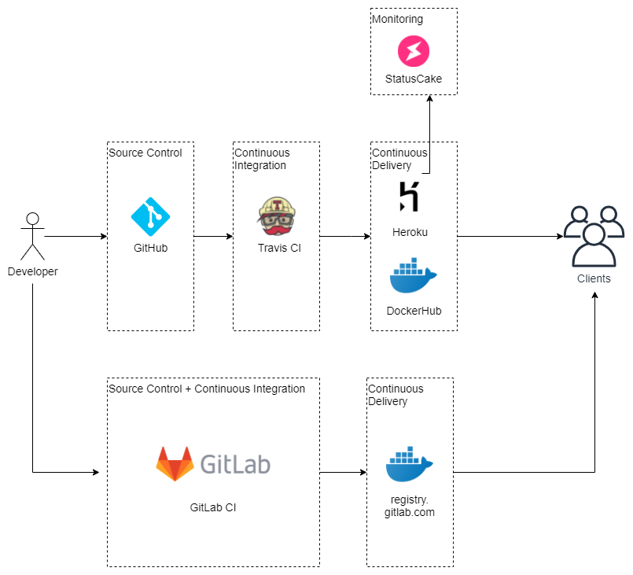

# Proces budowy aplikacji dydaktycznej se_hello_printer_app

## Wprowadzenie

Aplikacja Dydaktyczna se_hello_printer_app to program wyświetlający imię i wiadomość w formatach json oraz xml. Do jego stworzenia wykorzystano język Python w wersji 3 oraz framework Flask.

Aplikacja w wersji 1.0.0 posiada dodatkowe funkcjonalności:
*	wsparcie dla formatu XML (w podstawowej wersji XML przetwarzany, obsługiwany i testowany jako string)
*	wsparcie dla formatu JSON
*	obsługa imienia podanego przez użytkownika
*	rozszerzona funkcjonalność testów formatera i widoków
*	test statycznej podstrony HTML z wykorzystaniem Selenium w TravisCI; do testu wykorzystano bibliotekę flask_testing i klasę LiveServerTestCase

## Przygotowanie kodu źródłowego

Podstawą projektu jest system kontroli wersji GIT. Kod źródłowy rozwijany w lokalnej kopii repozytorium umieszczany jest w serwisie internetowym GitHub w publicznym repozytorium projektu. Wysyłanie zmian do serwisu internetowego jest realizowane za pomocą poleceń git.

#### Proces przygotowania kodu źródłowego:

*	utwórz fork z repozytorium https://github.com/wojciech11/se_hello_printer_app (lub z https://github.com/akubicz/se_hello_printer_app jeśli chcesz zacząć pracę od wersji aplikacji opisywanej w niniejszym dokumencie)
*	sklonuj aplikację do swojego repozytorium git
*	uruchom aplikację według wskazówek zawarych w README.md

## Tworzenie Single Point Entry

Każdy projekt powinien mieć skrypt (albo Makefile), który zawiera najczęściej wykonywane polecenia. W tym celu w projekcie stworzono plik Makefile zawierający komendy sterowane poleceniem make.

W pliku przewidziano następujące komendy dla make:
*	deps – instalacja wszystkich pakietów dla programu
*	lint – uruchomienie linter’a
*	test – uruchom wszystkie testy
*	run – uruchomienie aplikacji na maszynie dev
*	test_smoke – uruchom testy dymne
*	test_cov – analiza pokrycia testami kodu
*	test_xunit - generacja xunit i coverage
*	docker_build – budowa obrazu dockera
*	docker_run – uruchomienie dockera
*	docker_push – push obrazu dockera do DockerHub
*	docker_gitlab_push – push obrazu dockera do registry.gitlab.com
*	test_without_selenium – wykonaj testy z pominięciem testu ui z wykorzystaniem Google Chrome i Selenium.  
Test Selenium dla prostego pliku html serwowanego przez flask realizowany w pliku sterującym travis-ci, w gitlab-ci realizowane są testy bez Selenium

## Continuous Integration z TravisCI

Repozyorium projektu w serwisie GitHub połączone jest z usługą Travis CI. Instrukcje realizowane w usłudze zawarte są w pliku konfiguracyjnym projektu .travis.yml.
W pierwszej kolejności Travis CI instaluje zależności z pliku requirements.txt i test_requirements.txt oraz dodatkowe pakiety niezbędne w teście Selenium. Następnie włącza linter i testy (test, xunit). Jeśli procedura się powiedzie, realizowana jest budowa dockera i umieszczenie zbudowanego dockera w DockerHub oraz deployment aplikacji w serwisie Heroku. Obie te czynności są realizowane z wykorzystaniem zmiennych środowiskowych zapisanych w ustawieniach usługi Travis CI. Wprowadzone zmienne zawierają dane wymagane do autoryzacji w tych serwisach.

#### Proces tworzenia CI w TravisCI:

*	stwórz plik konfiguracyjny .travis.yml w twoim projekcie i dodaj go do repozytorium na Github
*	zarejestruj się na stronie https://travis-ci.com wykorzystując swoje konto Github
*	aktywuj projekt (powinien zostać automatycznie wykryty) i wykonaj testy

## Continuous Deployment z TravisCI

W ramach Ciągłego Dostarczania (CD) w TravisCI realizowane są 2 procesy:
*	wystawianie obrazu dockera do DockerHub (repozytorium współdzielone z Klientem)
*	wystawianie aplikacji w serwisie Heroku

#### Docker

Polecenia umożliwiające budowę i uruchomienie dockera, czy też jego deployment zawarte są w Makefile i wykorzystywane w pliku konfiguracyjnym TravisCI. Aby zbudować pakiet Dockera niezbędne jest również zdefiniowanie pliku Dockerfile.

##### Proces budowy pakietu dockera i publikacji obrazu z TravisCI:

*	stwórz plik Dockerfile zawierający procedurę budowy pakietu
*	rozbuduj Makefile o zadania dotyczące dockera (build, run, push)
*	zarejestruj się w serwie https://hub.docker.com
*	przetestuj dodawanie obrazu dockera do repozytorium z wykorzystaniem terminala
*	zautomatyzuj proces logowania do DockerHub poprzez dodanie w Makefile użytkownika oraz zmiennej na hasło. Hasło wprowadź jako zmienną środowiskową w ustawieniach TravisCI (sekret)
*	opublikuj zmiany w git i przetestuj działanie procesu CI/CD
*	zasymuluj deployment z wykorzystaniem obrazu ściągniętego z DockerHub

#### Heroku

Aplikacja jest hostowana w usłudze typu PaaS – Heroku.

#### Proces deploymentu do Heroku:

*	utwórz konto w serwisie https://heroku.com
*	dodaj gunicorn do pliku requirements.txt
*	stwórz plik Procfile
*	zainstaluj Heroku CLI
*	dodaj do pliku .travis.yml deployment do Heroku; skorzystaj z dokumentacji na stronie https://docs.travis-ci.com/user/deployment/heroku/
*	umieść aplikację na platformie Heroku (w ramach CI/CD poprzez publikację zmian w GIT)
*	zweryfikuj prawidłowość działania procesu

Moja aplikacja na Heroku: http://sleepy-bastion-27218.herokuapp.com/

## Monitorowanie w StatusCake

Aplikacja hostowana na Heroku monitorowana jest z wykorzystaniem usługi StatusCake.

#### Proces aktywacji usługi StatusCake dla aplikacji:

*	załóż konto w https://www.statuscake.com/
*	stwórz grupę kontaktową z adresami e-mail
*	dodaj Uptime Monitoring test, w konfiguracji wprowadź URL aplikacji wystawionej na Heroku

## CI/CD z GitLab

W trakcie rozwoju aplikacji przewidziano dodatkową ścieżkę CI/CD z wykorzystaniem GitLab.

#### Proces tworzenia CI/CD z GitLab:

*	załóż osobne konto w https://gitlab.com
*	utwórz nowy projekt i powiąż go z URL twojego repozytorium GitHub
*	wybierz zakładkę CI/CD i zapoznaj się z instrukcją
*	stwórz plik konfiguracyjny .gitlab-ci.yml
*	dodaj do pliku tworzenie dockera
*	dodaj deployment docker image do repozytorium repository.gitlab.com

